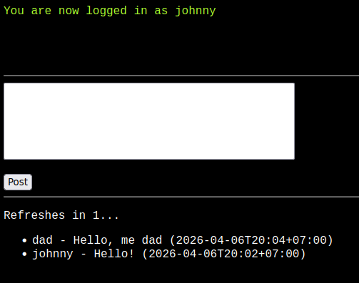

# bash-only mini social media

A mini social media server in pure bash!

> [!WARNING]
> I'm no security expert. Don't trust any of the code!

```bash
./run.sh -h
```

you'll need to have `netcat` and `jq` installed. other than that it uses standard unix commands that you should already have.

all data is stored in a `db` directory that gets automatically made on startup. `db/posts.json` stores a list of posts. `db/accounts.json` stores a list of accounts and their hashed+salted password. passwords have their bytes xor'ed before sending to the server just to avoiding sending passwords in plain-text. (still not very secure and easily un-xor-able)

